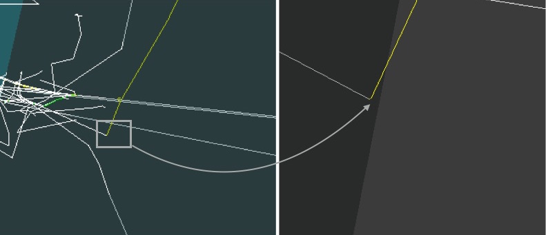
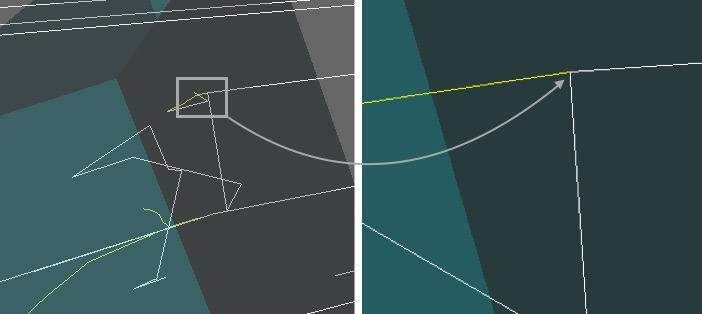
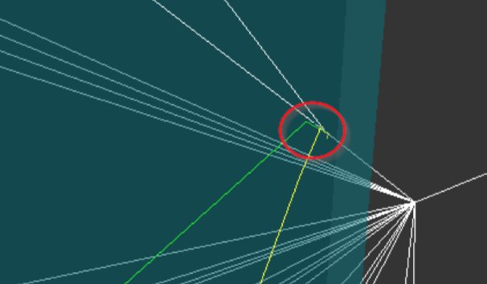
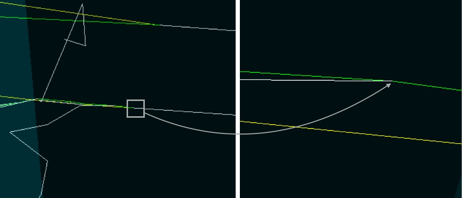
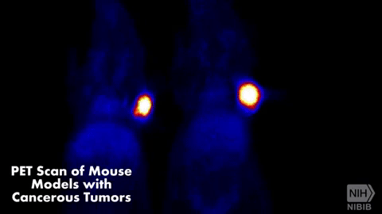
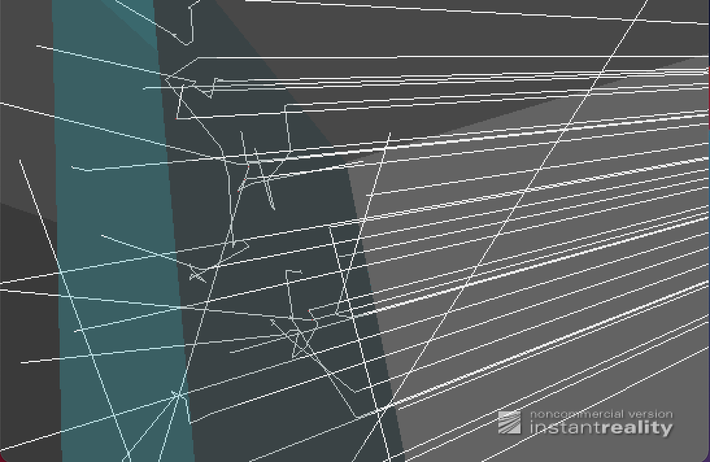

# LABORATORIO DE FÍSICA DE PARTÍCULAS

### Autor: Christian Suárez Heuvan

[TOC]


## **Objetivo**

Simular la interacción básica de partículas con ciertos medios gracias al software [Geant4](https://geant4.web.cern.ch/geant4/), desarrollado por el [CERN](https://home.cern)

En este laboratorio vamos a manejar una serie de contenedores Docker para *orquestar* una serie de servicios sencillos virtualizados. En lugar de instalar [Docker](https://www.docker.com) en nuestro ordenador, vamos a usar el servicio gratuito [Play with Docker](https://labs.play-with-docker.com).

Este servicio no es más que un *playground* para que quien quiera pueda explorar la creación y gestión de contenedores virtuales basados en Docker. 


## **Algunos Conceptos**

### Efecto fotoeléctrico

El efecto fotoeléctrico se produce cuando tiene lugar una interacción entre un fotón (partícula incidente) y un átomo. La consecuencia de una interacción fotoeléctrica es la emisión de electrones (fotoelectrones), debido a la absorción total de la energía del fotón por el electrón ligado. El fotón es absorbido completamente y *desaparece* de la escena. 




### Efecto Compton

El efecto Compton tiene lugar en la interacción de un fotón (partícula incidente) y un electrón poco ligado al átomo. Se produce entonces una colisión *casi elástica*. Al colisionar el fotón con el electrón este es desviado, y el fotón original también. Puede asemejarse a un *choque de bolas de billar*. A veces si la energía del fotón incidente es muy justa, el electrón (o electrones, en el caso de una colisión múltiple) desviado apenas avanza (su traza es muy pequeña, casi imperceptible) y da la sensación de que el fotón (que, recordamos, no es más que luz) está *zigzagueando*. 



**Pregunta: ¿cuánto tiempo puede estar *serpenteando* un fotón que *nace* en el centro del Sol hasta llegar a la retina de cualquiera de tus ojos?**

Desde que parten los fotones desde el centro del sol tienen que recorrer 660 000 Km hasta llegar a la superficie de la tierra (hasta nuestros ojos) y en dicho recorrido chocarán contra millones de protones lo que produciría que cambien de dirección constantemente en cada choque. Existe un modelo matemático que simula el interior del sol y gracias al cual se ha llegado a calcular que lo que tardan los fotones desde que nacen en el centro del sol hasta llegar a nuestra retina es aproximadamente **170 000 años**. Esto se puede observar mejor en [este video  explicativo](https://www.youtube.com/embed/Z-UO-RZBQ3U).


### Producción de pares

El efecto de creación de pares tiene lugar con fotones de alta energía (> 1.1 MeV), y representa un **proceso de materialización de energía** en el sentido de la Mecánica Relativista. El fenómeno que tiene lugar es la desaparición del fotón en el campo del núcleo, y la creación en su lugar de un par positrón-electrón (materia y antimateria). 

**Pregunta: ¿qué es un positrón? ¿Quién postuló su existencia teórica y cuándo y cómo se descubrió experimentalmente?**

El positrón o antielectrón es una antipartícula del electrón. Es decri, es un electrón ya que posee sus mismas características como cantidad de masa y espín, pero a diferencia del electrón, el positrón posee carga positiva, es decir 1e.

La existencia de esta partícula fue predicha por el ingeniero eléctrico, matemático y físico teórico Británico **Paul Adrien Maurice  en 1928. Más tarde, en 1932, sería el físico Estadounidense **Carl David Anderson** quien, fotografiando huellas de rayos cósmicos en una cámara de niebla, demostraría la existencia del positrón.





### Ionización

Si en los choques de una partícula cargada con los electrones atómicos, la energía transferida es superior a la energía de enlace del electrón que *recibe el impacto*, este abandona el átomo y en consecuencia se crea un ion positivo. El electrón expulsado puede a continuación zigzaguear hasta ser capturado por un átomo del entorno (la traza deja de verse porque, como hemos comentado, el electrón se *para*). 


### Bremsstrahlung

Cuando una partícula incidente con masa y carga eléctrica interacciona con un núcleo atómico, puede sufrir una variación súbita de su velocidad, emite radiación electromagnética (un fotón).




### Aniquilación de pares

Si un positrón y un electrón se encuentran, se *aniquilan* creando dos fotones que son emitidos en direcciones opuestas. 


**Pregunta: ¿qué relación tiene la modalidad radiológica PET con la aniquilación de pares electrón-positrón? ¿Cómo se *trasladan* positrones hasta el interior de las células cancerígenas?**

La relación existente entre la radiología PET y la aniquilación de pares de electrón-positrón es que este tipo de radiología se basa en ese principio de aniliquilación ya que las zonas del cuerpo que se sospecha pueda padecr alguna enfermedad desprenderá positrones (previamente "insertados" por el médico) y estos chocaran con los electrones presentes en el cuerpo produciendo la aniquilación de ambas partículas generando así dos fotones que se aceleran en direcciones opuestas. Posteriormente los escaneres PET mediran esos fotonos y usaran esa información para crear una imagen de la distribución del cancer (en caso de buscar cancer) que se busca en el cuerpo. Se aprecia mejor en el siguiente gif:



La forma en que la que llegan los positrones a las células cancerígenas es la siguiente:

1. Primero se administra al paciente una inyección intravenosa que contiene moléculas portadoras de un átomo radioactivo llamado isótopo . Dicha molécula puede ser FDG (Flurodesoxiglucosa) que se usa para la detección de cáncer.

   

   

2. La molécula portadora (FDG) puede unirse a proteínas o azúcares del cuerpo ya que contiene glucosa y es absorbida por los tejidos. Cuando un tejido absorbe mucha glucosa puede ser síntoma de tumor cancerígeno. El isótopo que se ha suministrado presenta pequeñas partículas que son los llamados positrones y es así como llegan estas partículas al las células cancerígenas. 

   

   

   

## **Respuesta a preguntas**

**Pregunta: ¿Cuál es la diferencia entre una *imagen* y un *contenedor*?**

Una imagen (Image) contiene lo necesario para ejecutar una aplicación como: código, librerias, variables de entornos, ficheros de configuración. Sin embargo un contenedor (Docker) es una instancia en teimpo de ejecución de una imagen. A partir de una imagen se puede crear varios contenedores.

**Pregunta: ¿Qué hace el siguiente comando? y ¿De qué subcomandos se compone y qué papel juegan (`ifconfig, grep, awk y sed`)?**

```bash
echo ip$(ifconfig eth1 | grep "inet " | awk -F'[: ]+' '{ print $4 }' | sed 's/\./-/g')-$SESSION_ID
```

El comando anterior lo que hace es mostrar (`echo`) una línea cuyo inicio es *ip* más lo que se obtiene a través del comando `ifconfig`. Lo primero es obtener la información de la interfaz *eth1* pero filtrando solo la *inet* que es donde se encuentra la IP que es lo que necesitamos. A continuación se utiliza `awk -F` para separar la línea en campos y así poder tomar el cuarto campo que es la IP la cual se toma con la opción `{print $4}` que equivaldría al cuarto campo.  Hasta aquí tenemos *IP172.18.0.41*. Lo siguiente es cambiar los puntos por guiones (*-*) en la IP, esto se consigue con el comando `sed` que indica cambiar comas por guiones y por último se añade a todo esto un guión más el ID de la sesión (`$SESSION_ID`). El resultado final es: `ip172-18-0-41-c09ilq36hnp00098f0r0` 

- `ifconfig` => programa que permite configurar o desplegar parámetros de las interfaces de red residentes en un núcleo como pueden ser la IP o la máscara de red.
- `grep` => es un comando unix utilizado para filtrar las coincidencias que se indiquen con el comando
- `awk` => es una herramienta de procesamiento de patrones en líneas de texto que se utiliza para filtrar ficheros o salida de comandos unix
- `sed` => es un editor de flujo de ficheros que permite modificar el contenido de las diferentes líneas de un ficheroen base a una serie de comandos

**Pregunta: ¿Qué otros formatos estándar de representación 3D conoces (Collada, Stanford, Wavefront, X3D Extensible, Standard Tessellation Language, x3dom, etc.)? ¿Quién desarrolla Instant Player qué contribuciones ha hecho al mundo de la tecnología?**

Entre los estándares de respresentación 3D que conozco podría destacar:

- **Collada.** Es un formato que permite el intercambio de información entre aplicaciones. Su nombre viene de **COLLA**borative **D**esign **A**ctivity
- **glTF.** Formato que posee la posibilidad de animación y caracteristicas que ayudan a mejorar el trabajo en la web. Su nombre es **GL** **T**ransission **F**ormat
- **Stanford.** También conocido como **PLY**(Ploigon File Format). El formato de almacenamiento permite una descripción simple de un solo objeto como una lista de polígonos planos. Se pueden almacenar multiples propiedades como color, transparencia, coordenadas de textura y valores de confianza de datos.
- **Wavefront.** Es un formato desarrollado por Wavefront Technologies. La extensión de este tipo de ficheros suele ser .obj. Este formato permite allmacenar datos importantes como coordenadas, archivos y mapas de textura.
- **X3D.** Desarrollado en lenguaje de modelado de realidad virtual (VRML) y está diseñado para funcionar en plataforma web. Posibilita la descripción de una escena compuesta por objetos 3D a partir de prototipos de formas geométricas.
- **STL.** Proviene del inglés **ST**ero**L**ithography y fue creado por 3D System. Anteriormente era conocido como Standard Tessellation Language. Se utiliza para la creación de prototipos, impresión 3D y fabricación asistida por ordenador.
- **Instant Player.** Es un visor de instrucciones VRML y fue desarrollado por **instantreality** que es un proyecto impulsado por el ministerio de Eduación e Investióganción de Alemania en conjunto con la unión de otros proyecto como son VIVERA, ARTESAS, ULTRAS, etc. Este proyecto ha contribuido en el mundo de la tecnología en múltiples aplicaciones como pueden ser: reconocimiento facial, escenas de 3D como las que vemos en Street View, componente geoespacial como el usado por Google Earth, seguimieto de esqueleton OpenNI como el que usa la Kinect de la Xbox de Microsoft.

**Pregunta: ¿En qué proyectos está involucrada la fundación Kitware y cómo han cambiado el mundo de la informática, la tecnología, la ciencia y la medicina?** Pista: [CMake](https://cmake.org/), [VTK](http://vtk.org/), [ITK](https://itk.org/), etc.

La fundación Kitware es un caompañía tecnológica ubicada en Nueva York especializada en la investigación y desarrollo de software de código abierto sobre todo en áreas de visión por computador, imágenes médicas, visualización científica y análisis de información multidimensional. 

Está involucrada en proyectos como: **CMake** para administrar la automatización de la construcción del software utilizando un método independiente del compilador, **VTK** que es un sistema para realizar gráficos en 3D por computadora, procesar imágenes y visualización. **MIDAS** que es un servidor multimedia que permite el análisis de datos científicos y visualización de los mismos a través de clientes. **IGSTK** consistente en un conjunto de herramientas para cirugías guiadas por imágenes lo cual es un avance que contribuye en gran medida al campo de la medicina. [AQUI](https://www.youtube.com/watch?v=ebJuPFsVdHY) un ejemplo de su funcionamiento.

**Pregunta:** **¿qué es Docker? ¿Qué son los *contenedores virtuales*? ¿Qué alternativas a Docker existen ([OpenVZ](https://openvz.org/), [LXC](https://linuxcontainers.org/), [Vagrant](https://www.vagrantup.com/), [rkt](https://coreos.com/rkt/), [Singularity](https://sylabs.io/), etc.)? Resume brevemente la historia de Docker. ¿Por qué Docker se ha convertido en un software tan popular?** 

Docker es es una plataforma software (aplicaciones + servicios) que permite la creación, implementación y pruebas de aplicaciones de forma rápida y segura.

Un contenedor virtual es aquel se encuentra accesible desde cualquier ordenador o cualquier parte del mundo. Es decir, no precisamos instalarnos nada fisicamente ya que podemos acceder a ellos de forma remota para trabajar con ellos.

Las alternativas a Docker pueden ser **Vagrant** que nos ayuda a crear y manejar máquinas virtuales con un mismo entorno de trabajo, **OpenVZ** que es una tecnología de virtualización a nivel de SSOO para Linux, **LXC** que es una tecnología de virtualización a nivel de SSOO para Linux, **Singularity** es la misma tecnología de virtualización pero llevado al mundo de la computación de alto rendimiento, es decir, para empaquetar flujos de trabajo  complejos. Por último otro ejemplo de virtualización es **KVM**  que se diferencia principlamente de LXC o de OpenVZ por ser multiplataforma, es decir, se puede usar tanto en Linux como en Windows.

**Preguntas: ¿Qué es un fichero `ppk`? ¿Qué es una clave RSA público/privada (fichero `key`)?**

Un fichero *ppk* es un fichero privado utilizado por el aplicativo PuTTY para la auntenticación. 

Una clave *RSA* (Rivest, Shamir y Adleman) es un sistema criptográfico basado en la factorización de número enteros y que utiliza dos keys (llaves) una pública utilizada para cifrar mensajes y una privada utilizada para descifrar el mensaje.

**Pregunta: ¿qué es el [Hub](https://hub.docker.com/) de Docker? **

Es un repositorio público alojado en la nube y similar a Github para almacenar y distribuir las imágenes que usan los contenedores. Es mantenido por la propia Docker. 


## **Ejecución de simulación básica**


**Pregunta: ¿cómo se llama a este [tipo de haz](https://htmlpreview.github.io/?https://github.com/pammacdotnet/FFRepo/blob/master/geant4lab2021.html#search="pencil beam") de partículas?**

Rayos X o gamma.

**Pregunta: ¿Qué son los archivos `wrl`? ¿De qué estándar internacional se trata? **

Loa archivos *wrl* son ficheros VRML World, es decir, de lenguaje de modelado de realidad virtual y está basado en texto (ASCII).  Se trata del estándar internacional VRML que se utiliza para la representación en 3D.

**Pregunta: ¿Cómo es posible que veamos figuras 3D en una página web? ¿Qué estándares, alternativas, consorcios e instituciones están implicados? ¿Qué alternativa estamos usando en este ejercicio ([pista](https://www.web3d.org/)) y qué gran centro de investigación en matemáticas estuvo implicado ([pista](https://dl.acm.org/doi/10.1145/1559764.1559784))?**

Podemos ver figuras 3D gracias al trabajo conjunto de los programas **WebGL** y a las **GPU** (Unidad de procesacimento gráfico) de los ordenadores. Las WebGL son programas escritos en JavaScript que pemite usar la implementación nativa de OpenGL ES 2.0 que se ejecutan en una GPU. Está dieñado por el consorrcio de tecnología sin ánimo de lucro *Khronos Group*, aunque a lo largo de su historia ha contado con participaciones como la de *Mozilla*, *Apple*, *Google*, *Opera*, etc. 

Entre las alternativas podemos destacar la *O3D* de Google, o la que estamos usando en este ejercicio: Web3d basado en X3D que es un estandar web basado en gráficos 3D. 

El gran centro de investigación que estuvo implicado es **Fraunhofer-Gesellschaft** que es una organización de investigación alemana que comprende 72 institutos esparcidos por toda Alemania, cada uno con una especialización en un campo diferente de las ciencias aplicadas.


## **Ejecución de varias simulaciones**

### Simulación 1

|          |               |
| :----------------------: | ----------------------------- |
| `type=e-     energy=0.5` | `count=50     material=G4_Al` |

En esta simulación lanzamos 50 partículas de tipo electrones con una energía de 0.5 MeV hacia un material que es este caso es Aluminio. Observamos como ningún electrón (líneas rojas) traspasa el aluminio y concretamente se ve como el electrón con carga y masa interactúa con el núcleo del átomo y se frena generando un fotón (la línea blanca). Es lo que se conoce como *Bremsstrahlung*. También se produce efecto *Compton* ya que los electrones al chocar con el aluminio salen despedidos, alguno se ven la trayectoria porque llevan mucha energía y otros apenas se aprecian dada la poca energía que llevan y terminan por ser absorbidos.

### Simulación 2

|             |               |
| :-------------------------: | :---------------------------: |
| `type=gamma     energy=0.8` | `count=60     material=G4_Fe` |

En esta simulación lanzamos 60 partículas de tipo gamma con una energía de 0.8 MeV hacia un material que en este caso es Hierro. Se observa cómo ningún haz de luz atraviesa el hierro, todos son repelidos generando así un efecto *Compton* al chocar las partículas gamma contra los átomo de hierro. Los que llevan más energía toman rutas más largas y lo que tienen poca se observa que su ruta se acorta hasta que son absorbidos por el material. 

### Simulación 3

|             |                |
| :-------------------------: | :----------------------------: |
| `type=gamma     energy=0.3` | `count=40     material=G4_AIR` |

En esta simulación lanzamos 40 partículas de tipo gamma con una energía de 0.3 MeV hacia un material que en este caso es Aire. En esta simulación, al tratarse de aire, los rayos gamma chocan contra los átomos del aire parece que atraviesan el material con más velocidad, puede que se deba el efecto *Compton* que al chocar contra el átomo, la partícula sale disparada siguiendo su camino pero a mayor velocidad. Por le contrario, las partículas que no llevan suficiente energía no llegan a traspasar el material.

### Simulación 4

|       |            |
| :----------------------: | :---------------------------: |
| `type=e+     energy=0.9` | `count=60     material=G4_Au` |

En esta simulación lanzamos 60 partículas de tipo positrón con una energía de 0.9 MeV hacia un material que en este caso es Oro. Aquí observamos como todos los rayos son absorbidos y cómo se produce el efecto  ya que al chocar un positrón con un átomo de oro se emite un electrón. Los que tiene más energía parece que se repelen y los que tienen poca son absorbidos. Se observa también *Aniquilación de pares* ya que al chocar el positrón con el electrón se observa cómo salen dos fotones despedidos en sentidos opuestos. 

### Simulación 5

|             |                  |
| :-------------------------: | :------------------------------: |
| `type=gamma     energy=1.2` | `count=30     material=G4_WATER` |

En esta simulación lanzamos 30 partículas de tipo electrones con una energía de 1.2 MeV hacia un material que en este caso es Agua. En este caso observamos aplicando mucho zoom un efecto  al chocar el fotón con el átomo de agua emitiendo electrones. Por otro lado vemos que los rayos atraviesan el material pero tomando muchos caminos, es decir desviándose y no siguiendo la trayectoria inicial, esto se debe al choque entre fotón y electrón causando la desviación de trayectoria convirtiéndola en una trayectoria zigzagueada. Es lo que se conoce como efecto *Compton*


